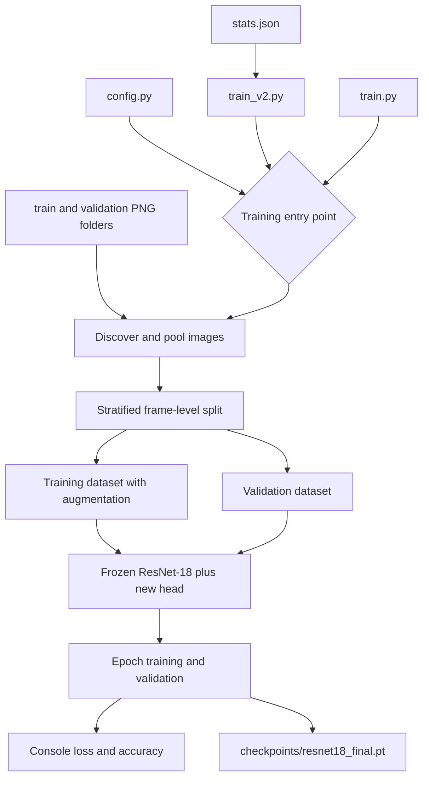
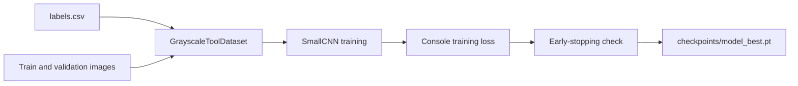
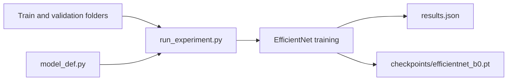
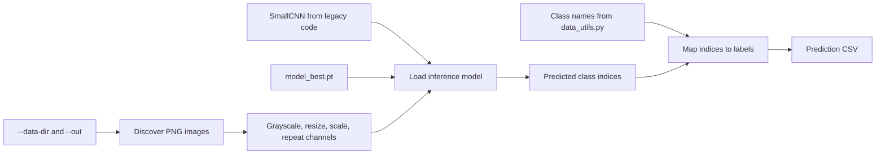
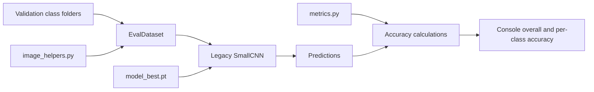
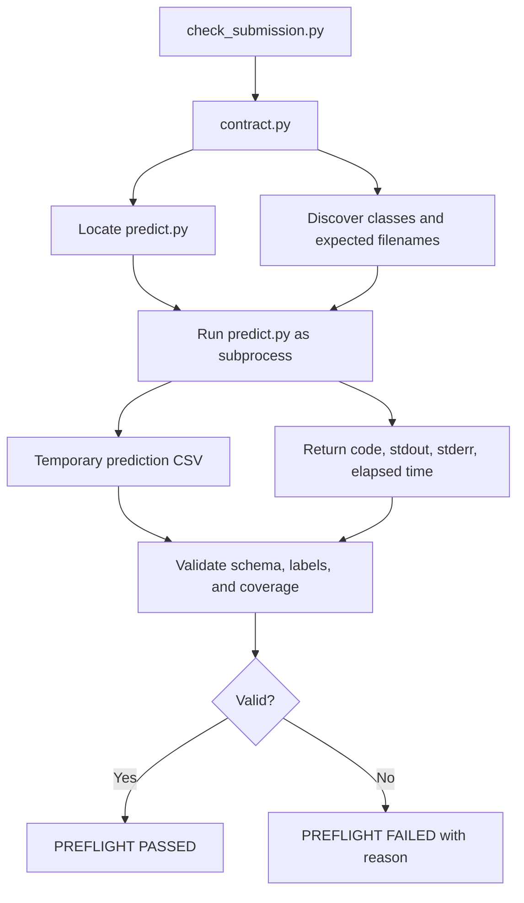

# Machine Learning Pipeline Overview

This document describes the current training, prediction, evaluation, and submission-validation workflows. The repository contains multiple model paths, so the checkpoint produced by the main ResNet training scripts is not currently the checkpoint consumed by prediction and evaluation.

## Training Pipeline

### ResNet-18 Training

The main training implementation is `train.py`. `train_v2.py` is an alternative entry point that reuses the same implementation with dataset-specific normalization and different runtime parameters.

#### Execution Order

1. `config.py` supplies the learning rate, epoch count, image size, dataset root, and other constants.
2. `train.py` scans the `train/` and `validation/` class directories and pools their image paths.
3. The pooled images are divided into a new stratified training and validation split.
4. `ToolDataset` loads, resizes, augments, and normalizes each image.
5. A pretrained ResNet-18 is created, its backbone is frozen, and its final layer is replaced for four-class classification.
6. The classifier head is trained with SGD.
7. Training loss, validation loss, and validation accuracy are printed after each epoch.
8. The final model state is saved to `checkpoints/resnet18_final.pt`.

When `train_v2.py` is executed, it first loads channel statistics from `stats.json`, overrides the normalization values used by `train.py`, and then calls the same training function with alternate parameters.

#### Files Involved

- `config.py`
- `train.py`
- `train_v2.py`
- `stats.json`
- Dataset files under `train/` and `validation/`

#### Inputs

- PNG surgical frames organized by split and class.
- Dataset path from `config.py`.
- Training parameters from `config.py` or `train_v2.py`.
- ImageNet normalization values in `train.py`, or dataset statistics from `stats.json` when using `train_v2.py`.

#### Outputs and Intermediate Artifacts

- Per-epoch training loss printed to the console.
- Per-epoch validation loss and accuracy printed to the console.
- Final checkpoint: `checkpoints/resnet18_final.pt`.
- No metrics CSV, run metadata, optimizer state, or best-validation checkpoint is currently saved.

### Legacy CNN Training

The checkpoint currently used by prediction and evaluation is produced by `legacy/cnn_baseline_v2.py`, not by the ResNet pipeline.

#### Execution Order

1. Read labels from `labels.csv`.
2. Locate each image across the train and validation folders.
3. Convert images to grayscale, resize them to 128 by 128, and repeat the grayscale channel three times.
4. Train `SmallCNN` using Adam and mean squared error against one-hot labels.
5. Monitor training loss for early stopping.
6. Save the model state whenever training loss improves.

#### Inputs

- `labels.csv`.
- Images in the train and validation directories.
- Script-local training parameters.

#### Outputs and Intermediate Artifacts

- Training loss printed to the console.
- Best-by-training-loss checkpoint: `checkpoints/model_best.pt`.

### EfficientNet Experiment

`experiments/exp02_efficientnet/run_experiment.py` is an isolated training experiment. It uses the model builder in `model_def.py`, applies its own transforms and parameters, and saves an EfficientNet checkpoint that is not consumed by the active prediction pipeline.

## Prediction Pipeline

The prediction interface is implemented by `predict.py` and is the primary externally required entry point.

### Execution Order

1. Receive `--data-dir` and `--out` command-line arguments.
2. Discover PNG files in either a flat input directory or one level of class subdirectories.
3. Load each image, convert it to grayscale, resize it to 128 by 128, scale it to the zero-to-one range, and repeat it across three channels.
4. Import the `SmallCNN` architecture from `legacy/cnn_baseline_v2.py`.
5. Load `checkpoints/model_best.pt`.
6. Run batched inference without gradient calculation.
7. Map predicted indices to class names from `data_utils.py`.
8. Write the requested prediction CSV.

### Files Involved

- `predict.py`
- `data_utils.py`
- `legacy/cnn_baseline_v2.py`
- `checkpoints/model_best.pt`

### Inputs

- `--data-dir`: directory containing PNG images.
- `--out`: destination CSV path.
- Legacy CNN checkpoint.
- Ordered class-name list.

### Outputs and Intermediate Artifacts

- In-memory batches of preprocessed tensors and predictions.
- CSV with header `filename,predicted_class`.
- Console message reporting the number of predictions written.

## Evaluation Pipeline

The current evaluation workflow is implemented by `evaluate_model.py` and evaluates the legacy CNN checkpoint against the validation directory.

### Execution Order

1. Discover class directories and PNG images under the validation dataset.
2. Load and preprocess images using `helpers/image_helpers.py`.
3. Build `SmallCNN` from `legacy/cnn_baseline_v2.py`.
4. Load `checkpoints/model_best.pt`.
5. Run inference over the validation DataLoader.
6. Calculate batch accuracy using `helpers/metrics.py`.
7. Accumulate per-class correct and total counts.
8. Print overall and per-class accuracy.

### Files Involved

- `evaluate_model.py`
- `helpers/image_helpers.py`
- `helpers/metrics.py`
- `legacy/cnn_baseline_v2.py`
- `checkpoints/model_best.pt`

### Inputs

- Validation images organized into class directories.
- Legacy CNN checkpoint.
- Evaluation preprocessing and class-name definitions.

### Outputs and Intermediate Artifacts

- Batch accuracies held in memory.
- Per-class counts held in memory.
- Overall and per-class accuracy printed to the console.
- No evaluation CSV, JSON report, F1 score, precision, recall, or confusion matrix is currently saved.

## Submission Validation Pipeline

The submission preflight is implemented by `check_submission.py` using the reusable rules in `contract.py`. It validates execution and output structure, not prediction quality.

### Execution Order

1. Set the repository root and local validation directory.
2. Use `contract.find_entry_point()` to locate `predict.py`.
3. Discover class names and expected PNG filenames from the validation directory.
4. Create a temporary output directory.
5. Run `predict.py --data-dir <validation> --out <temporary-csv>` as a subprocess.
6. Check the subprocess return code and timeout.
7. Validate the CSV header, row structure, class vocabulary, and filename coverage.
8. Print `PREFLIGHT PASSED` or a failure reason.

### Files Involved

- `check_submission.py`
- `contract.py`
- `predict.py`
- Prediction dependencies and `checkpoints/model_best.pt`

### Inputs

- Repository root containing `predict.py`.
- Validation image directory.
- Expected class names inferred from validation subdirectories.
- Prediction checkpoint and runtime dependencies.

### Outputs and Intermediate Artifacts

- Temporary prediction CSV, removed when the check finishes.
- Captured prediction stdout, stderr, return code, and elapsed time.
- Validation result containing status, failure reason, and row count.
- Final console pass/fail message.

## Current Pipeline Disconnects

- `predict.py` and `evaluate_model.py` use the legacy CNN checkpoint, not the checkpoints created by `train.py`, `train_v2.py`, or the EfficientNet experiment.
- Training, prediction, and evaluation do not share one centralized preprocessing definition.
- Class-name ordering is defined in multiple locations.
- Most metrics are printed to the console rather than stored as durable experiment artifacts.
- `run_all.sh` trains EfficientNet and then evaluates a different legacy CNN checkpoint.
