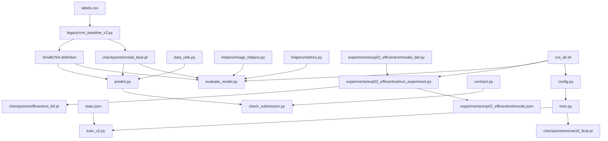
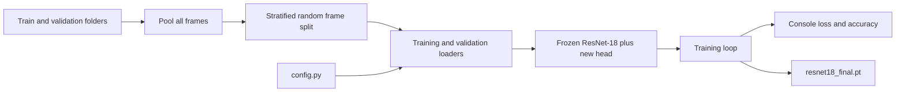
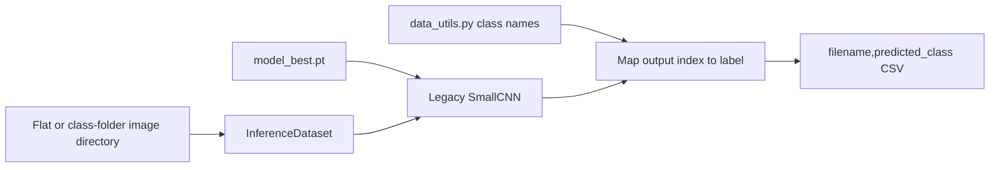
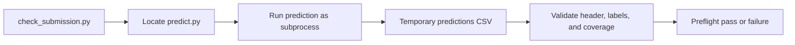

# Project Architecture

## High-Level Overview

This repository contains a small PyTorch image-classification project for identifying four laparoscopic surgical tools: clipper, grasper, hook, and scissor. It includes training implementations, an evaluation script, a prediction command-line interface, a submission preflight contract, experiment artifacts, and project documentation.

The repository currently has multiple partially independent model paths:

1. A ResNet-18 training path implemented by `train.py` and `train_v2.py`.
2. A legacy custom CNN that still supplies the model used by prediction and evaluation.
3. A separate EfficientNet-B0 experiment under `experiments/`.

These paths do not yet share one model artifact, preprocessing definition, class mapping, or configuration source.

## Repository Structure

| Path | Purpose |
| --- | --- |
| `docs/` | Project planning, architecture, and engineering change documentation. |
| `configs/` | YAML parameter sets from earlier or proposed experiments. They are not currently loaded by the active training scripts. |
| `experiments/` | Isolated experimental implementations and their recorded results. |
| `helpers/` | Reusable image-processing and metric helpers, mainly used by evaluation. |
| `legacy/` | Superseded training code and the custom CNN still required by the current prediction and evaluation paths. |
| `notebooks/` | Exploratory data analysis and dataset-label preparation. |
| `splits/` | Stored train/validation split metadata. The active training script currently recomputes its split instead of loading this file. |
| `data/` | Expected repository-local dataset location. Excluded from Git. |
| `checkpoints/` | Generated model weights. Excluded from Git. |
| `runs/`, `logs/`, `outputs/` | Intended generated experiment artifacts. Excluded from Git. |

## Python Files

### Root Files

| File | Purpose | Status |
| --- | --- | --- |
| `config.py` | Defines central ResNet training constants such as learning rate, batch size, epochs, class count, image size, weight decay, and dataset path. | Active for `train.py`; incomplete as a project-wide configuration source. |
| `train.py` | Loads images, creates a stratified frame-level split, builds a frozen ResNet-18 backbone with a new classifier, trains the head, prints metrics, and saves `resnet18_final.pt`. | Active training entry point. |
| `train_v2.py` | Wraps `train.py`, replaces normalization values with `stats.json`, and supplies alternate batch size, learning rate, and epoch values. | Active alternative training entry point. |
| `predict.py` | Loads the legacy `SmallCNN` checkpoint and writes the required `filename,predicted_class` CSV. | Active submission entry point. |
| `evaluate_model.py` | Evaluates the legacy `SmallCNN` checkpoint and prints overall and per-class accuracy. | Active evaluation entry point, but not connected to ResNet training. |
| `check_submission.py` | Runs `predict.py` through the shared contract and validates the output CSV structure. | Active preflight entry point. |
| `contract.py` | Defines entry-point discovery, prediction subprocess execution, expected filenames, class discovery, timeout behavior, and CSV schema validation. | Active submission infrastructure. |
| `data_utils.py` | Defines class names and several dataset implementations. `predict.py` currently uses its class-name function. | Partially active; contains unused dataset classes. |
| `utils.py` | Provides seeding, device selection, class discovery, and trainable-parameter counting helpers. | Currently unused by the main scripts. |

### Helper Files

| File | Purpose | Status |
| --- | --- | --- |
| `helpers/__init__.py` | Marks `helpers` as a Python package. | Active package support. |
| `helpers/image_helpers.py` | Loads dataset statistics, preprocesses images with OpenCV, and supplies a class-name list for evaluation. | Active only in evaluation. |
| `helpers/metrics.py` | Implements batch accuracy, epoch accuracy, and a confidence helper. | Active only in evaluation; some helpers are unused. |

### Experiment Files

| File | Purpose | Status |
| --- | --- | --- |
| `experiments/exp02_efficientnet/model_def.py` | Builds an EfficientNet-B0 classifier. | Experimental. |
| `experiments/exp02_efficientnet/run_experiment.py` | Defines transforms, trains EfficientNet-B0, computes a final accuracy, writes `results.json`, and saves a checkpoint. | Experimental; not connected to prediction. |

### Legacy Files

| File | Purpose | Status |
| --- | --- | --- |
| `legacy/cnn_baseline_v2.py` | Defines and trains the custom `SmallCNN`, saving `model_best.pt`. | Legacy training code, but its model definition and checkpoint remain active dependencies of prediction and evaluation. |
| `legacy/old_train.py` | Provides video-ID extraction and a video-grouped split intended to prevent related-frame leakage. | Legacy and not imported; potentially useful for future split improvements. |

## Primary Entry Points

| Command | Role | Main output |
| --- | --- | --- |
| `python train.py` | Train the ResNet-18 classifier head. | `checkpoints/resnet18_final.pt` |
| `python train_v2.py` | Run the ResNet path with alternate normalization and parameters. | `checkpoints/resnet18_final.pt` |
| `python legacy/cnn_baseline_v2.py` | Train the CNN currently used by prediction. | `checkpoints/model_best.pt` |
| `python evaluate_model.py` | Evaluate `model_best.pt`. | Console accuracy report |
| `python predict.py --data-dir <directory> --out <file.csv>` | Produce predictions using `model_best.pt`. | Prediction CSV |
| `python check_submission.py` | Verify prediction execution and CSV compatibility. | Console pass/fail report |
| `python experiments/exp02_efficientnet/run_experiment.py` | Run the EfficientNet experiment. | Checkpoint and `results.json` |
| `bash run_all.sh` | Train EfficientNet, evaluate the unrelated legacy CNN checkpoint, and print selected config values. | Mixed pipeline outputs |

## Internal Dependencies

External dependencies include PyTorch, torchvision, NumPy, Pillow, pandas, scikit-learn, and OpenCV.

## Training Workflow

### ResNet-18

`train_v2.py` uses the same workflow but overrides normalization statistics and selected runtime parameters. Neither ResNet checkpoint is currently consumed by `predict.py` or `evaluate_model.py`.

### Legacy CNN

The legacy CNN loads image labels from `labels.csv`, searches the train and validation directories for each image, converts frames to grayscale, trains on the combined dataset, and saves the checkpoint with the best training loss. This checkpoint is the one used by the current prediction and evaluation scripts.

### EfficientNet Experiment

The EfficientNet experiment uses `ImageFolder`, experiment-specific transforms, and a model from `model_def.py`. It saves `efficientnet_b0.pt` and a small JSON result file. It is isolated from production prediction and evaluation.

## Prediction Workflow

`predict.py` is the required compatibility surface. It accepts `--data-dir` and `--out`, recursively handles one level of class directories, and writes one predicted class for each PNG image.

## Evaluation Workflow

`evaluate_model.py` reads the validation folders, preprocesses images using `helpers/image_helpers.py`, loads the legacy CNN checkpoint, and prints overall and per-class accuracy. It does not currently record results to a file or calculate macro-F1, precision, recall, or a confusion matrix.

## Submission Workflow

The shared `contract.py` module keeps entry-point discovery and output validation separate from model implementation. The preflight validates execution and schema only; it does not assess prediction correctness.

## Duplicated Functionality and Technical Debt

- Dataset paths are defined independently in `config.py`, `evaluate_model.py`, the legacy CNN, the EfficientNet experiment, and the EDA notebook.
- Class names and class ordering are defined independently in `data_utils.py`, `utils.py`, `helpers/image_helpers.py`, folder discovery, and the legacy CNN.
- Image loading and preprocessing are implemented separately in `train.py`, `predict.py`, `data_utils.py`, `helpers/image_helpers.py`, the legacy CNN, and the EfficientNet experiment.
- Dataset classes are duplicated across `train.py`, `predict.py`, `evaluate_model.py`, `data_utils.py`, and the legacy CNN.
- ResNet, legacy CNN, and EfficientNet checkpoints have no shared artifact format containing architecture, preprocessing, or class metadata.
- The two YAML configuration files are disconnected from executable training code and have drifted from `config.py` and script-local values.
- `utils.seed_everything()` is not called by the active training scripts and does not fully seed PyTorch.
- The stored split in `splits/split_seed42.json` is not used by `train.py`; potentially safer video-grouped splitting remains in legacy code.
- Training metrics are mostly printed to the console rather than saved as structured experiment records.
- `run_all.sh` trains EfficientNet but then evaluates the unrelated legacy CNN checkpoint.
- The legacy directory contains code that remains operationally required, making the active-versus-legacy boundary unclear.
- Training, evaluation, and prediction use inconsistent preprocessing and potentially inconsistent class-index mappings.
- Corrupt or missing images may be silently replaced with blank inputs, which can hide data-quality problems.

These issues should be addressed incrementally, with each cleanup preserving the required prediction interface and corresponding to a separately reviewed change.
